# AWS Infrastructure Architecture

## Overview

This document describes the complete AWS infrastructure architecture for the Portfolio application, deployed using Terraform and GitHub Actions CI/CD.

## Architecture Diagram

```mermaid
graph TB
    subgraph Internet
        Users[Users/Clients]
        GitHub[GitHub Actions]
    end

    subgraph DNS["Route 53"]
        R53[Hosted Zone<br/>dev.therpiproject.com]
        ACM[ACM Certificate<br/>SSL/TLS]
    end

    subgraph VPC["VPC - 10.0.0.0/16"]
        subgraph AZ1["Availability Zone 1 (us-east-1a)"]
            subgraph PublicSubnet1["Public Subnet<br/>10.0.1.0/24"]
                NAT1[NAT Gateway]
                ALB1[Application<br/>Load Balancer]
            end
            subgraph PrivateSubnet1["Private Subnet<br/>10.0.10.0/24"]
                Frontend1[Frontend Task<br/>Next.js<br/>256 CPU / 512 MB]
                Backend1[Backend Task<br/>FastAPI<br/>256 CPU / 512 MB]
            end
        end

        subgraph AZ2["Availability Zone 2 (us-east-1b)"]
            subgraph PublicSubnet2["Public Subnet<br/>10.0.2.0/24"]
                NAT2[NAT Gateway]
                ALB2[Application<br/>Load Balancer]
            end
            subgraph PrivateSubnet2["Private Subnet<br/>10.0.11.0/24"]
                Frontend2[Frontend Task<br/>Next.js<br/>256 CPU / 512 MB]
                Backend2[Backend Task<br/>FastAPI<br/>256 CPU / 512 MB]
            end
        end

        IGW[Internet Gateway]

        subgraph Data["Data Layer"]
            RDS[(RDS PostgreSQL<br/>db.t4g.micro<br/>20GB Storage)]
            Redis[(ElastiCache Redis<br/>cache.t4g.micro<br/>1 Node)]
        end

        subgraph Security["Security Groups"]
            SG_ALB[ALB Security Group<br/>Allow: 80, 443]
            SG_ECS[ECS Security Group<br/>Allow: 3000, 8000]
            SG_RDS[RDS Security Group<br/>Allow: 5432]
            SG_Redis[Redis Security Group<br/>Allow: 6379]
        end
    end

    subgraph ECS["Amazon ECS"]
        Cluster[ECS Cluster<br/>Fargate]
        FrontendService[Frontend Service<br/>Auto-scaling: 1-4]
        BackendService[Backend Service<br/>Auto-scaling: 1-4]
    end

    subgraph ECR["Amazon ECR"]
        FrontendRepo[Frontend Repository<br/>Image Scanning Enabled]
        BackendRepo[Backend Repository<br/>Image Scanning Enabled]
    end

    subgraph Monitoring["CloudWatch"]
        Logs[Log Groups<br/>30-day retention]
        Metrics[Metrics & Alarms<br/>CPU, Memory]
        Dashboard[CloudWatch Dashboard]
        Insights[Container Insights]
    end

    subgraph CI_CD["CI/CD Pipeline"]
        TerraformWF[Terraform Workflow<br/>Infrastructure]
        BackendWF[Backend Workflow<br/>Build & Deploy]
        FrontendWF[Frontend Workflow<br/>Build & Deploy]
    end

    Users -->|HTTPS| R53
    R53 -->|DNS Resolution| ALB1
    R53 -->|DNS Resolution| ALB2
    ACM -.->|SSL Certificate| ALB1
    ACM -.->|SSL Certificate| ALB2

    ALB1 -->|Port 3000| Frontend1
    ALB1 -->|Port 8000| Backend1
    ALB2 -->|Port 3000| Frontend2
    ALB2 -->|Port 8000| Backend2

    Frontend1 -->|API Calls| Backend1
    Frontend2 -->|API Calls| Backend2

    Backend1 -->|SQL| RDS
    Backend2 -->|SQL| RDS
    Backend1 -->|Cache| Redis
    Backend2 -->|Cache| Redis

    Frontend1 -.->|Internet via| NAT1
    Frontend2 -.->|Internet via| NAT2
    Backend1 -.->|Internet via| NAT1
    Backend2 -.->|Internet via| NAT2

    NAT1 --> IGW
    NAT2 --> IGW
    ALB1 --> IGW
    ALB2 --> IGW

    Cluster -.->|Manages| FrontendService
    Cluster -.->|Manages| BackendService
    FrontendService -.->|Deploys| Frontend1
    FrontendService -.->|Deploys| Frontend2
    BackendService -.->|Deploys| Backend1
    BackendService -.->|Deploys| Backend2

    GitHub -->|Terraform Apply| TerraformWF
    GitHub -->|Build & Push| BackendWF
    GitHub -->|Build & Push| FrontendWF

    TerraformWF -.->|Creates/Updates| VPC
    BackendWF -->|Push Image| BackendRepo
    FrontendWF -->|Push Image| FrontendRepo

    BackendRepo -.->|Pull Image| Backend1
    BackendRepo -.->|Pull Image| Backend2
    FrontendRepo -.->|Pull Image| Frontend1
    FrontendRepo -.->|Pull Image| Frontend2

    Frontend1 -->|Logs| Logs
    Frontend2 -->|Logs| Logs
    Backend1 -->|Logs| Logs
    Backend2 -->|Logs| Logs

    Cluster -->|Metrics| Metrics
    Metrics -->|Visualize| Dashboard
    Cluster -->|Insights| Insights

    SG_ALB -.->|Controls| ALB1
    SG_ALB -.->|Controls| ALB2
    SG_ECS -.->|Controls| Frontend1
    SG_ECS -.->|Controls| Frontend2
    SG_ECS -.->|Controls| Backend1
    SG_ECS -.->|Controls| Backend2
    SG_RDS -.->|Controls| RDS
    SG_Redis -.->|Controls| Redis

    classDef aws fill:#FF9900,stroke:#232F3E,stroke-width:2px,color:#fff
    classDef compute fill:#ED7100,stroke:#232F3E,stroke-width:2px,color:#fff
    classDef database fill:#3B48CC,stroke:#232F3E,stroke-width:2px,color:#fff
    classDef network fill:#8C4FFF,stroke:#232F3E,stroke-width:2px,color:#fff
    classDef security fill:#DD344C,stroke:#232F3E,stroke-width:2px,color:#fff
    classDef monitoring fill:#759C3E,stroke:#232F3E,stroke-width:2px,color:#fff
    classDef cicd fill:#4B612C,stroke:#232F3E,stroke-width:2px,color:#fff

    class VPC,AZ1,AZ2 network
    class RDS,Redis database
    class Frontend1,Frontend2,Backend1,Backend2,Cluster,FrontendService,BackendService compute
    class Logs,Metrics,Dashboard,Insights monitoring
    class SG_ALB,SG_ECS,SG_RDS,SG_Redis security
    class TerraformWF,BackendWF,FrontendWF,GitHub cicd
```

## Architecture Components

### Networking Layer

#### VPC Configuration
- **CIDR Block**: 10.0.0.0/16
- **Availability Zones**: 2 (us-east-1a, us-east-1b)
- **High Availability**: Multi-AZ deployment for fault tolerance

#### Subnets
**Public Subnets** (10.0.1.0/24, 10.0.2.0/24)
- Application Load Balancer
- NAT Gateways
- Internet Gateway attachment

**Private Subnets** (10.0.10.0/24, 10.0.11.0/24)
- ECS Fargate tasks (Frontend & Backend)
- RDS PostgreSQL database
- ElastiCache Redis cluster
- No direct internet access (egress via NAT Gateways)

#### Network Components
- **Internet Gateway**: Enables internet connectivity for public subnets
- **NAT Gateways**: 2 (one per AZ) for private subnet internet access
- **Route Tables**: Separate for public and private subnets

### DNS & SSL

#### Route 53
- **Hosted Zone**: dev.therpiproject.com (dev) / therpiproject.com (prod)
- **DNS Records**:
  - A record pointing to ALB
  - AAAA record for IPv6
  - CNAME for www subdomain

#### AWS Certificate Manager (ACM)
- **SSL/TLS Certificate**: Wildcard certificate (*.therpiproject.com)
- **Validation**: DNS validation via Route 53
- **Protocol**: TLS 1.3 with modern cipher suites

### Compute Layer

#### Amazon ECS (Elastic Container Service)
**Cluster Configuration**
- **Type**: Fargate (serverless)
- **Container Insights**: Enabled for detailed monitoring

**Frontend Service**
- **Framework**: Next.js 15 (React 19)
- **Resources**: 256 CPU units (0.25 vCPU), 512 MB memory
- **Port**: 3000
- **Scaling**: 1-4 tasks based on CPU utilization (target: 70%)
- **Health Check**: HTTP GET on /

**Backend Service**
- **Framework**: FastAPI (Python)
- **Resources**: 256 CPU units (0.25 vCPU), 512 MB memory
- **Port**: 8000
- **Scaling**: 1-4 tasks based on CPU utilization (target: 70%)
- **Health Check**: HTTP GET on /api/v1/health

#### Deployment Configuration
- **Strategy**: Rolling update
- **Circuit Breaker**: Enabled with automatic rollback
- **Maximum Percent**: 200%
- **Minimum Healthy Percent**: 100%

### Load Balancing

#### Application Load Balancer (ALB)
- **Type**: Internet-facing
- **Scheme**: Application Load Balancer (Layer 7)
- **Listeners**:
  - HTTP (80) → Redirects to HTTPS
  - HTTPS (443) → Routes to target groups
- **Routing Rules**:
  - `/api/*` → Backend target group
  - `/*` → Frontend target group
- **Health Checks**: Enabled for both target groups

### Data Layer

#### RDS PostgreSQL
**Configuration**
- **Engine**: PostgreSQL 16.3
- **Instance Class**:
  - Dev: db.t4g.micro
  - Prod: db.t4g.small
- **Storage**:
  - Dev: 20 GB gp3
  - Prod: 50 GB gp3
- **Multi-AZ**: Disabled (dev), Enabled (prod)
- **Deletion Protection**: Enabled

**Security**
- **Encryption**: At-rest encryption enabled
- **Network**: Private subnets only
- **Access**: Via security group (ECS tasks only)

**Backup**
- **Automated Backups**: 7-day retention
- **Backup Window**: 03:00-04:00 UTC
- **Maintenance Window**: Mon 04:00-05:00 UTC

**Monitoring**
- **Enhanced Monitoring**: 60-second intervals
- **CloudWatch Logs**: postgresql, upgrade logs

#### ElastiCache Redis
**Configuration**
- **Engine**: Redis 7.1
- **Node Type**:
  - Dev: cache.t4g.micro
  - Prod: cache.t4g.small
- **Nodes**: 1 (dev), 2+ (prod with automatic failover)
- **Encryption**: At-rest enabled

**Cache Policy**
- **Eviction Policy**: allkeys-lru
- **Snapshot Retention**: 5 days
- **Snapshot Window**: 03:00-05:00 UTC

### Container Registry

#### Amazon ECR
**Repositories**
- Backend repository: portfolio-{env}-backend
- Frontend repository: portfolio-{env}-frontend

**Security**
- **Image Scanning**: Enabled on push
- **Encryption**: AES256

**Lifecycle Policies**
- Keep last 10 tagged images (prefix: v)
- Remove untagged images after 7 days

### Security

#### Security Groups

**ALB Security Group**
- Inbound: 80 (HTTP), 443 (HTTPS) from 0.0.0.0/0
- Outbound: All traffic

**ECS Security Group**
- Inbound: 3000, 8000 from ALB security group
- Outbound: All traffic

**RDS Security Group**
- Inbound: 5432 from ECS security group
- Outbound: All traffic

**Redis Security Group**
- Inbound: 6379 from ECS security group
- Outbound: All traffic

#### IAM Roles

**ECS Task Execution Role**
- Permissions to pull images from ECR
- Write logs to CloudWatch

**ECS Task Role**
- Application-specific permissions
- Access to AWS services (if needed)

### Monitoring & Logging

#### CloudWatch Logs
**Log Groups** (30-day retention)
- /ecs/portfolio-{env}/backend
- /ecs/portfolio-{env}/frontend
- /ecs/portfolio-{env}/cluster

#### CloudWatch Metrics & Alarms
**Metrics Tracked**
- ECS CPU utilization
- ECS memory utilization
- ALB request count
- ALB target response time
- RDS connections
- Redis CPU utilization

**Alarms**
- High CPU (>80% for 2 periods)
- High Memory (>80% for 2 periods)

#### CloudWatch Dashboard
- ECS cluster metrics visualization
- Service health overview
- Resource utilization trends

#### Container Insights
- Task-level metrics
- Container performance
- Network metrics

### CI/CD Pipeline

#### GitHub Actions Workflows

**Terraform Deployment**
- Workflow: `.github/workflows/terraform-deploy.yml`
- Trigger: Manual (workflow_dispatch)
- Actions: plan, apply, destroy
- Environments: dev, prod

**Backend Deployment**
- Workflow: `.github/workflows/backend-deploy.yml`
- Trigger: Push to main (backend changes)
- Steps:
  1. Run tests with coverage
  2. Build Docker image
  3. Push to ECR
  4. Update ECS service

**Frontend Deployment**
- Workflow: `.github/workflows/frontend-deploy.yml`
- Trigger: Push to main (frontend changes)
- Steps:
  1. Run linting
  2. Build Docker image
  3. Push to ECR
  4. Update ECS service

## Traffic Flow

### User Request Flow

1. **User** makes HTTPS request to `dev.therpiproject.com`
2. **Route 53** resolves domain to ALB DNS name
3. **ALB** terminates SSL using ACM certificate
4. **ALB** routes request based on path:
   - `/api/*` → Backend target group (port 8000)
   - `/*` → Frontend target group (port 3000)
5. **Target Group** forwards to healthy ECS task
6. **ECS Task** processes request:
   - **Frontend**: Serves Next.js application
   - **Backend**: Processes API request via FastAPI
7. **Backend** connects to:
   - **RDS**: For persistent data
   - **Redis**: For caching/sessions
8. **Response** flows back through ALB to user

### Deployment Flow

1. **Developer** pushes code to GitHub
2. **GitHub Actions** triggers appropriate workflow
3. **Workflow** runs tests/linting
4. **Docker Image** built and pushed to ECR
5. **ECS Service** updated with new task definition
6. **ECS** performs rolling update:
   - Starts new tasks with new image
   - Waits for health checks to pass
   - Drains and stops old tasks
7. **Circuit Breaker** monitors deployment:
   - Rolls back if failures detected
   - Maintains service availability

## Scalability

### Auto Scaling Configuration

**ECS Services**
- **Target Tracking**: CPU utilization at 70%
- **Min Capacity**: 1 task
- **Max Capacity**: 4 tasks
- **Scale Out**: Add task when CPU > 70% for 2 minutes
- **Scale In**: Remove task when CPU < 70% for 2 minutes

**Database Scaling** (Manual)
- Vertical: Change instance class
- Horizontal: Enable read replicas

**Cache Scaling**
- Add Redis nodes for read replicas
- Increase node size for more memory

## Cost Optimization

### Development Environment
- Smallest instance sizes (t4g.micro)
- Single-AZ database (no Multi-AZ)
- Minimal task count (1 task per service)
- No read replicas

### Production Environment
- Larger instances for better performance
- Multi-AZ database for high availability
- Multiple tasks per service
- Read replicas for database and cache

### Cost Breakdown (Dev)
- NAT Gateways: ~$65/month
- RDS (db.t4g.micro): ~$12/month
- ElastiCache (cache.t4g.micro): ~$12/month
- ALB: ~$16/month
- ECS Fargate: ~$10-20/month
- **Total**: ~$115-130/month

## High Availability & Disaster Recovery

### High Availability
- **Multi-AZ Deployment**: Resources across 2 AZs
- **Load Balancing**: ALB distributes traffic
- **Auto Scaling**: Replaces failed tasks automatically
- **Health Checks**: Removes unhealthy targets

### Disaster Recovery
- **Database Backups**: 7-day automated backups
- **Redis Snapshots**: Daily snapshots
- **Infrastructure as Code**: Full stack reproducible via Terraform
- **Container Images**: Versioned in ECR

### Monitoring & Alerting
- CloudWatch Alarms for critical metrics
- Container Insights for deep visibility
- Log aggregation for troubleshooting

## Security Best Practices

✅ **Network Security**
- Private subnets for all application resources
- Security groups with least-privilege access
- No direct internet access to database/cache

✅ **Data Security**
- Encryption at rest for RDS and ElastiCache
- Encryption in transit (HTTPS/TLS)
- SSL certificate for all traffic

✅ **Access Control**
- IAM roles with minimal permissions
- No hardcoded credentials
- Secrets managed via AWS Systems Manager (future)

✅ **Container Security**
- Image scanning on ECR push
- Regular base image updates
- Non-root container users

## Future Enhancements

### Short Term
- [ ] AWS WAF for web application firewall
- [ ] AWS Secrets Manager for credential management
- [ ] CloudFront CDN for static assets
- [ ] S3 for media storage

### Medium Term
- [ ] ElasticSearch for log analytics
- [ ] RDS read replicas for better read performance
- [ ] Multi-region deployment for global users
- [ ] DynamoDB for session storage

### Long Term
- [ ] Kubernetes migration (EKS)
- [ ] Service mesh (AWS App Mesh)
- [ ] Advanced monitoring (Datadog/New Relic)
- [ ] Chaos engineering for resilience testing

## Resources

- [Terraform Code](../terraform/)
- [GitHub Actions Workflows](../.github/workflows/)
- [Deployment Guide](../DEPLOYMENT.md)
- [AWS Well-Architected Framework](https://aws.amazon.com/architecture/well-architected/)
